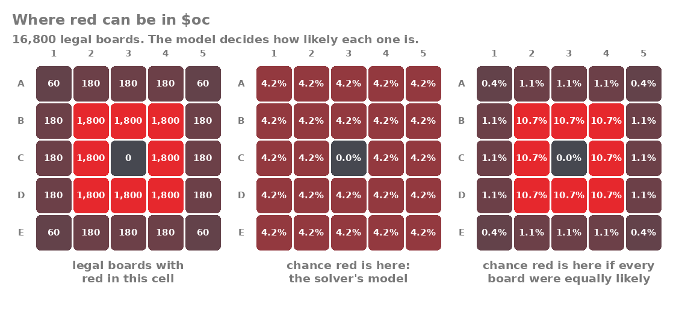
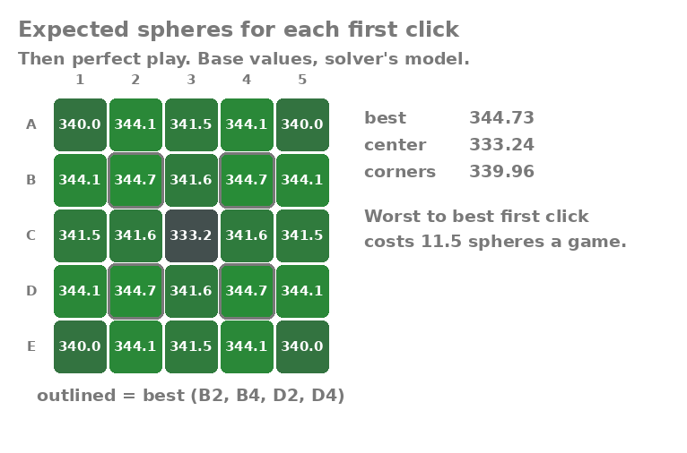
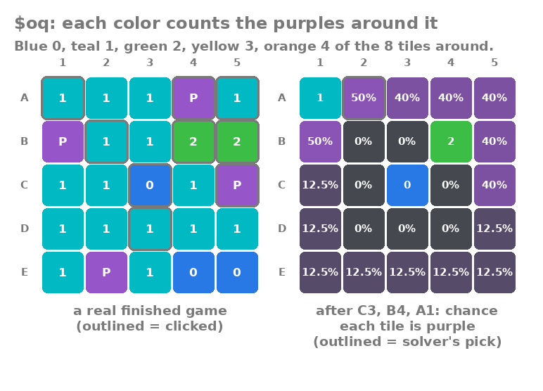
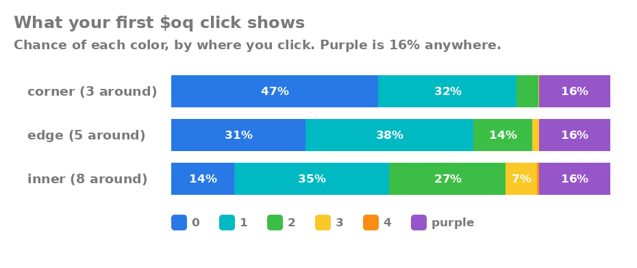
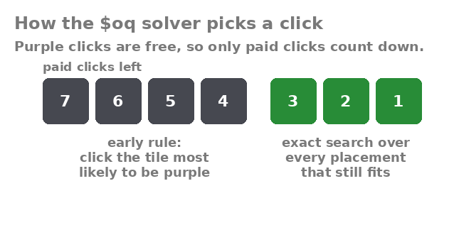

# mudae-sphere-solver

A Discord bot that recommends moves in Mudae's `$oc` and `$oq` sphere minigames and
shows the expected-value numbers behind each recommendation.

**[Invite the bot to your server](https://discord.com/oauth2/authorize?client_id=1554720194046197840&permissions=117760&integration_type=0&scope=bot)**

**[Add it to your account](https://discord.com/oauth2/authorize?client_id=1554720194046197840&integration_type=1&scope=applications.commands)** to use `/manual-input`, `/spherebonus`, `/colorblindmode`, `/global-stats`, `/my-stats` and **Solve sphere board** in any server or DM, even ones the bot isn't in. `/autoread` still needs the bot in the server, because it has to read Mudae's messages.

**Contents:** [Status](#status) · [Using the bot](#using-the-bot) · [`$oc`](#oc) ·
[`$oq`](#oq) · [Stats and privacy](#stats-and-privacy) ·
[Running your own copy](#running-your-own-copy) · [Development](#development) ·
[License](#license)

## Status

The bot solves `$oc` three ways: type the board into `/manual-input`, right-click a
Mudae board, or turn on `/autoread` and it follows your game as you click. `$oq` is
solved through `/manual-input` or `/autoread`; right-click doesn't read `$oq` boards.
Both solvers' expected values are verified by simulation. Games read by `/autoread`
feed `/global-stats` and `/my-stats`, which check the solver against real games.
`$oh` and `$ot` are not planned.

## Using the bot

**`/manual-input`:** pick the game, then type the board. Cells are a row letter and
column number. Leave out `board` for a new game. **Add a sphere** updates the board
as you play. If you clicked the cell the solver suggested, type just its color, like
`g`.

- `$oc`: `/manual-input game: $oc board: D4R B2T`, with colors R O Y G T B.
- `$oq`: `/manual-input game: $oq board: C3B B4G A1T`, with B T G Y O for 0 to 4
  purples around a tile, P for a purple, and R for the red once it appears.

**`/autoread`:** turns auto-read on or off. With it on, play `$oc` or `$oq` as
usual: the bot reads Mudae's board buttons directly (no image recognition), replies
with the best click, and updates its reply every time you click. You can also
right-click any Mudae `$oc` board → Apps → **Solve sphere board**. Two limits: typed
commands are only recognized with Mudae's default `$` prefix, and in very busy
servers the bot can lose track of a game, because discord.py only reports edits to
messages still in its cache of recent ones.

**`/global-stats` and `/my-stats`:** what the solver has done in real games, for
everyone or just you. See [Stats and privacy](#stats-and-privacy).

**`$oq` details:** with `/manual-input`, after you click the red, add it again (like
`D4 R`) so the bot counts that click. Hidden tiles show their chance of being purple,
and once every purple is known they show what each tile pays. When the game ends, the
bot shows your score, whether you got the red, how many of the solver's picks you
followed (a click exactly as good as the solver's counts as followed), and the best
score anyone could have got knowing where every purple was. That last number is a
ceiling, not a target: even perfect play can't reach it every game, because nobody
sees the board in advance. With `/autoread` it's worked out on the real board Mudae
reveals at the end; with `/manual-input` it's averaged over the boards that still
fit.

**Colorblind mode:** `/colorblindmode` toggles lettered color blocks (B T G Y O R)
instead of spheres, for your boards from then on.

**Sphere bonus:** Mudae server and user premium add a bonus to every sphere.
`/spherebonus flat: 6 percent: 25` tells the bot yours, so its numbers match what Mudae
pays you. The flat part is the +N on the "Additional spheres" line of `$kt`. It's saved
per server, because server premium differs from server to server. Each sphere pays
(base + flat) × (1 + percent/100), rounded half up. That matched 10 observed `$oq` and
`$oh` payouts; it hasn't been checked in a `$oc` game yet. Server multipliers aren't
included: they scale every sphere alike, so they never change the best click, but
the bot's scores and expected values leave them out. Only "spheres gained" in the
stats uses what Mudae actually paid.

## `$oc`

### Rules as modeled

- 5×5 board, 5 clicks, each click reveals only the cell clicked.
- 1 red, never in the center.
- 2 orange touching red on a side.
- 3 yellow anywhere on red's diagonals.
- 4 green anywhere in red's row or column.
- Teal on every other cell in red's row, column, or diagonals; blue everywhere else.

Exactly 16,800 boards satisfy these rules. `tests/test_oc_rules.py` checks that the
solver generates each of them once and nothing else. How many boards a red cell allows
depends on how many neighbors and diagonal cells it has:

| Red's cell | Cells | Legal boards each | Total |
| --- | --- | --- | --- |
| Corner (A1, A5, E1, E5) | 4 | 60 | 240 |
| Other edge cell | 12 | 180 | 2,160 |
| Next to the center | 8 | 1,800 | 14,400 |
| Center | 1 | 0 | 0 |
| **All** | | | **16,800** |

### Model assumption

Mudae's rules say where spheres can go, not how likely each board is. This solver
assumes each of the 24 non-center cells is equally likely to hold red, and that every
legal arrangement of the other spheres is equally likely once red is placed. This has
not been checked against game data yet, so every recommendation is conditional on it.
`/global-stats` counts where red was in every auto-read `$oc` game, per cell, to
settle it.

The other natural reading is that every legal board is equally likely. Because the 8
cells next to the center allow far more boards, that reading puts red there most of the
time:



| | Solver's model | Every board equally likely |
| --- | --- | --- |
| Chance red is on the outer ring | 66.7% | 14.3% |
| Best first click | B2 (or B4, D2, D4) | B2 (or B4, D2, D4) |
| Best possible average | 344.73 | 350.10 |
| This solver's average | 344.73 | 328.16 |

If Mudae actually works the second way, this solver averages 21.9 spheres a game (6%)
less than it could. Which reading is right is the biggest open question in this
project.

### Results

Under the solver's model, with base sphere values:



The best first clicks are the four cells diagonal to the center. The center itself is
the worst, because red is never there.

| First click | Expected spheres (then perfect play) |
| --- | --- |
| Diagonal to the center (B2, B4, D2, D4) | 344.73 |
| Edge, next to a corner (A2, B1, ...) | 344.07 |
| Next to the center, in line (B3, C2, C4, D3) | 341.61 |
| Middle of an edge (A3, C1, C5, E3) | 341.45 |
| Corner | 339.96 |
| Center | 333.24 |

Looking ahead matters. A greedy player who always takes the click with the best
immediate payout does noticeably worse:

| Strategy | Average spheres | Finds red |
| --- | --- | --- |
| This solver (plans all 5 clicks) | 344.73 | 99.98% |
| Greedy (best next click only) | 338.24 | 98.84% |

### Verification

`sim/verify_oc.py` generates random boards with its own code (independent of how
the solver enumerates boards), plays each one with the solver's recommended moves,
and compares the average score with the solver's prediction.

| Check | Result |
| --- | --- |
| Solver's predicted average, empty board | 344.73 |
| Simulated average, 20,000 games (seed 0) | 344.85 ± 0.41 |
| Difference | +0.29 standard errors: pass (limit 3) |

With a +6 / 25% sphere bonus (`python sim/verify_oc.py --flat 6 --percent 25`), the
solver predicts 468.40 and 20,000 simulated games average 468.54 ± 0.51 (+0.28 standard
errors: pass).

Every other `$oc` number in this README is checked the same way by
`python -m sim.verify_readme_numbers` (20,000 games per row, seed 1). The exact values
come from `python -m docs.readme_numbers`.

| Check | Exact | Simulated | Difference |
| --- | --- | --- | --- |
| Solver's model, this solver | 344.729 | 344.578 ± 0.411 | −0.37 SE |
| Finds red, % | 99.98 | 99.97 ± 0.01 | −0.56 SE |
| Solver's model, greedy | 338.240 | 338.630 ± 0.429 | +0.91 SE |
| Finds red, % | 98.84 | 98.78 ± 0.08 | −0.74 SE |
| First click A1, then perfect play | 339.964 | 339.966 ± 0.440 | +0.00 SE |
| First click A2, then perfect play | 344.066 | 344.534 ± 0.387 | +1.21 SE |
| First click A3, then perfect play | 341.451 | 341.254 ± 0.410 | −0.48 SE |
| First click B3, then perfect play | 341.606 | 341.488 ± 0.371 | −0.32 SE |
| First click C3, then perfect play | 333.244 | 333.271 ± 0.408 | +0.07 SE |
| Every board equally likely, best play | 350.099 | 350.087 ± 0.336 | −0.03 SE |
| Every board equally likely, greedy | 347.584 | 347.428 ± 0.345 | −0.45 SE |
| Every board equally likely, this solver | 328.158 | 328.188 ± 0.418 | +0.07 SE |

All pass (limit 3 standard errors). The check was confirmed to fail when a bug was
planted in the solver (off by 82 standard errors) and when the solver was given the
wrong red-position model (off by 43, same 20,000 games as the first table).

### Board symmetry

The square board has 8 symmetries: 4 rotations and 4 mirror images. Every `$oc` rule
(touching on a side, diagonal, same row or column, not the center) is unchanged by
them, so a partly revealed board and its rotated or mirrored copy have the same
expected value. The solver caches each position under one standard orientation, so
all 8 copies share one computation.

| | Without symmetry | With symmetry |
| --- | --- | --- |
| Positions computed, empty board | 156,967 | 20,337 (7.7× fewer) |
| Time to solve the empty board | 49.8 s | 7.7 s (6.5× faster) |
| Expected score, empty board | 344.7286 | 344.7286 |

Times are from one run and depend on the machine; the position counts don't.

Tests check that all 16,800 legal boards and their probabilities are unchanged by
each symmetry (a fake "symmetry" that shifts the board fails this), and that the
solver returns identical values and moves with and without it.

**<ins>Prefer a visual representation?</ins>**


## `$oq`

Solved by `/manual-input game: $oq` or `/autoread`. The solver is
`src/solver/oq_ev.py`; its rules and payouts are in `src/solver/modes/oq.py`.

### Rules as modeled

From Mudae's `$oq` rules text (saved in `data/mudae/oq_finished.txt`) and a finished
game:

- 5×5 board with 4 purple spheres hidden on it. You get 7 paid clicks.
- Clicking a purple is free. Find 3 and the 4th turns into a red sphere, which costs a
  click to collect. (The rules say "a red sphere or more"; the solver counts it as red.)
- Every other tile shows how many of the 8 tiles around it hold a purple:
  blue 0, teal 1, green 2, yellow 3, orange 4.

There are 12,650 ways to place 4 purples on 25 tiles. The solver assumes each is
equally likely. Like the `$oc` model, this hasn't been checked against game data.

Base payouts: purple 5, blue 10, teal 20, green 35, yellow 55, orange 90 and red 150
(red also seen as 195 with a +6 / 25% bonus, which only base 150 gives).

Sometimes the 4th purple turns into a rainbow sphere instead of red, worth 500. How
often isn't known, so the solver plans for red until a rainbow actually appears, then
values it at 500. The bot draws it as a striped tile with a star. `/global-stats`
counts reds and rainbows separately, so the rate can be measured.



On the right, after clicking C3, B4 and A1 from that game: C3 is blue, so none of the 8
tiles around it is purple. A1 is teal, so exactly one of A2, B1 and B2 is purple, and
B2 is ruled out, which leaves A2 and B1 at 50% each. B4 is green, so 2 of A3, A4, A5,
B5 and C5 are purple (40% each). The last purple is somewhere in the 8 tiles left
(12.5% each). That's 160 placements still possible. A2 and B1 tie at 50%, and the
solver picks A2 because it pays more on average when it isn't purple.

### What the first click shows



| Tile | Tiles around | Blue (0) | Teal (1) | Green (2) | Yellow (3) | Orange (4) | Purple |
| --- | --- | --- | --- | --- | --- | --- | --- |
| Corner | 3 | 47.31% | 31.54% | 4.98% | 0.17% | 0% | 16% |
| Edge | 5 | 30.64% | 38.30% | 13.52% | 1.50% | 0.04% | 16% |
| Inner | 8 | 14.39% | 35.42% | 26.56% | 7.08% | 0.55% | 16% |

The chance of k purples around a tile with m neighbors is
C(m, k) × C(24 − m, 4 − k) / C(25, 4). `docs/readme_numbers.py` checks this formula
against all 12,650 placements.

### How it picks a click



An exact search looks at every placement that still fits the board and every way the
game could go. Its cost grows 14 to 18 times with each extra paid click left:

| Paid clicks left | Positions searched | Time |
| --- | --- | --- |
| 2 | 1,092 | 0.3 s |
| 3 | 19,208 | 5.5 s |
| 4 | 276,400 | 88 s |

(One mid-game board, on a 2.1 GHz Intel Xeon cloud machine.) Searching from the first
click isn't practical, so the solver searches exactly only for the last 3 paid clicks,
or as soon as only one placement fits. Before that it clicks the tile most likely to
be purple; ties go to the higher expected payout, then the first tile in reading
order. When several clicks lead to the same expected total, as happens once every
purple is known, it suggests the one that pays the most right away.

With 3 paid clicks left the cost also depends on how many placements still fit.
`sim/time_oq_search.py` timed boards played by the early rule (at most 72 placements
left, at most 6 s) and by random clicks (16 to 315 placements, up to 22 s); one board
with four blues in a corner leaves 1,820 placements and took 43 s. So with 3 left
and more than 100 placements, the rule plays one more click and the exact search
starts at 2 left, where even 1,001 placements took 4 s.

### Choosing the early-game rule

`sim/compare_oq_heuristics.py` played 2,000 games with each candidate rule, on the same
boards, with exact search for the last 3 paid clicks in every case. Payouts were the
+6 / 25% bonus values from a real game log; yellow and orange didn't appear in it, so
those two used placeholder values.

| Early-game rule | Average spheres |
| --- | --- |
| Most likely purple (the one used) | 507.12 ± 1.42 |
| colblitz-style mix: P(purple) + 0.1 × Gini | 3.97 ± 1.19 fewer |
| Same mix with weight 0.4 | 3.60 ± 1.15 fewer |
| Most informative click | 6.05 ± 1.20 fewer |

The differences are paired on the same boards. "colblitz-style" is this repository's
reading of the formula on colblitz's quest page, not colblitz's own code. The rule used
is the best of the rules tried, not a proven optimum.

### Verification

`sim/verify_oq.py` places purples with its own generator, plays the solver's own picks
from three mid-game positions (4,000 games each), and compares with the exact value.
It uses test payouts that give every color a different value.

| Position | Exact | Simulated | Difference |
| --- | --- | --- | --- |
| 2 paid clicks left | 183.175 | 182.405 ± 1.207 | −0.64 SE |
| 2 left, 2 purples found | 247.875 | 247.269 ± 0.691 | −0.88 SE |
| 3 left, 1 purple found | 308.738 | 307.880 ± 0.640 | −1.34 SE |

All pass (limit 3 standard errors).

## Stats and privacy

`/global-stats` (public reply) and `/my-stats` (only you see it) show:

- games played, spheres gained (the sum of Mudae's own "+N" lines, so bonuses and
  multipliers are included), and how many of the solver's picks were followed;
- spheres clicked per color, including `$oq` purples, reds and rainbows;
- **`$oc` accuracy:** in games where every pick was followed (a click exactly as good
  as the solver's counts), the average score against the solver's prediction (± one
  standard error), and how often red was found against the predicted 99.98%;
- **where red was** in `$oc`: a count for each cell, and the share on the outer ring
  against 66.7% (the solver's model) and 14.3% (every legal board equally likely);
- **`$oq` accuracy:** in games where every pick was followed, the share of the best
  score possible with hindsight on the real board, and the score against the
  solver's prediction once exact search took over (left out when a rainbow appeared
  after that prediction, since it assumed a red).

The accuracy figures describe followed games; they aren't a perfect test of the
solver. A player who stops following after a bad start drops out of them.

**What counts:** only games read by `/autoread`, never typed boards, which could
have typos. Right after a board, Mudae posts a "(Rewards appear here)" message and
adds a line to it for every click. A game counts only if exactly one rewards message
appeared within 2 seconds of its board, and its lines match the clicks the bot saw,
color for color, in order. Otherwise it's left out.

**What's stored:** running totals (counts, sums and sums of squares), never a record
of each game.

- `stats.json` holds the global totals, with no user, server, channel or message IDs.
- `my_stats.json` holds each player's totals under their Discord user ID, the same
  way `settings.json` stores `/autoread`, `/colorblindmode` and `/spherebonus`
  choices. `/my-stats delete: True` removes yours; the global totals keep the games.

Each file is written atomically after every change, so a crash can't leave one
half-written, and none of them is ever committed to this repository. The two stats
files are written one after the other, so a crash between the two writes would leave
them one game apart.

## Running your own copy

Allowed under the [license](LICENSE) as long as the link to this repository stays
on every board message, as it does here.

1. Create a bot at discord.com/developers/applications and invite it with the
   `bot` and `applications.commands` scopes.
2. Install Python 3.11 or newer, then, in the repository folder:
   `python -m venv .venv`, activate it (`.venv\Scripts\Activate.ps1` on Windows,
   `source .venv/bin/activate` elsewhere), and `pip install -r requirements.txt`.
3. Copy `.env.example` to `.env` and fill in `DISCORD_TOKEN` (and, for development,
   `DISCORD_GUILD_ID` so commands appear in your test server immediately).
4. `python -m src.bot.main`

Auto mode needs **Message Content Intent** enabled on your bot's developer page.

## Development

```
python -m venv .venv
.venv\Scripts\Activate.ps1
pip install -r requirements.txt
pytest
python sim/verify_oc.py
python -m sim.verify_oq
python -m sim.verify_readme_numbers
ruff format .
ruff check .
```

The README's numbers and images are generated, not typed in:

```
python -m docs.readme_numbers        # exact values -> docs/readme_numbers.json
python -m docs.make_readme_images    # $oc and $oq images
python -m docs.make_symmetry_images  # symmetry images
```

## License

MIT with an attribution requirement: you may use, modify, and build on this code if
you keep the link to this repository visible. See [LICENSE](LICENSE).
