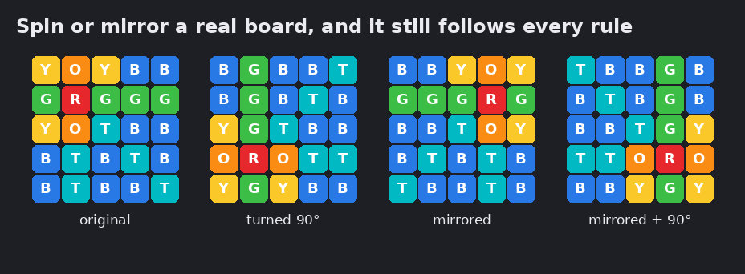
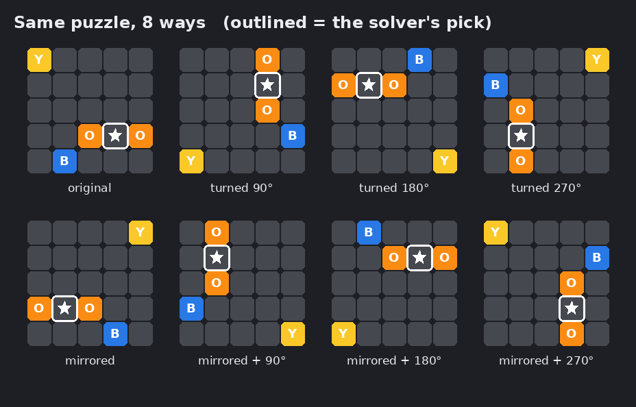

# mudae-sphere-solver

A Discord bot that recommends moves in Mudae's `$oc` sphere minigame and shows the
expected-value numbers behind each recommendation.

**[Invite the bot to your server](https://discord.com/oauth2/authorize?client_id=1554720194046197840&permissions=117760&integration_type=0&scope=bot)**

## Status

Phase 1: `$oc` solver with the board typed in through a `/oc` slash command. The
solver's expected values are verified by simulation. The bot replies with a rendered
board showing the best click.

## `$oc` rules as modeled

- 5×5 board, 5 clicks, each click reveals only the cell clicked.
- 1 red, never in the center.
- 2 orange touching red on a side.
- 3 yellow anywhere on red's diagonals.
- 4 green anywhere in red's row or column.
- Teal on every other cell in red's row, column, or diagonals; blue everywhere else.

Exactly 16,800 boards satisfy these rules. `tests/test_oc_rules.py` checks that the
solver generates each of them once and nothing else.

## Model assumption

Mudae's rules say where spheres can go, not how likely each board is. This solver
assumes each of the 24 non-center cells is equally likely to hold red, and that every
legal arrangement of the other spheres is equally likely once red is placed. This has
not been checked against game data, so every recommendation is conditional on it.

## Verification

`sim/verify_oc.py` generates random boards with its own code (independent of how
the solver enumerates boards), plays each one with the solver's recommended moves,
and compares the average score with the solver's prediction.

| Check | Result |
| --- | --- |
| Solver's predicted average, empty board | 344.73 |
| Simulated average, 20,000 games (seed 0) | 344.85 ± 0.41 |
| Difference | +0.29 standard errors: pass (limit 3) |

The check was confirmed to fail when a bug was planted in the solver (off by 82
standard errors) and when the solver was given the wrong red-position model (off by 22).

## Board symmetry

The square board has 8 symmetries: 4 rotations and 4 mirror images. Every `$oc` rule
(touching on a side, diagonal, same row or column, not the center) is unchanged by
them, so a partly revealed board and its rotated or mirrored copy have the same
expected value. The solver caches each position under one standard orientation, so
all 8 copies share one computation.

| | Without symmetry | With symmetry |
| --- | --- | --- |
| Positions computed, empty board | 156,967 | 20,337 (7.7× fewer) |
| Time to solve the empty board | 49.8 s | 7.7 s (6.5× faster) |
| Expected score, empty board | 344.7286 | 344.7286 |

Tests check that all 16,800 legal boards and their probabilities are unchanged by
each symmetry (a fake "symmetry" that shifts the board fails this), and that the
solver returns identical values and moves with and without it.

<u><strong>**Prefer a visual representation?**</strong></u>   





## Using the bot

Type `/oc board: D4R B2T` in Discord: cells as row letter + column number, colors as
R O Y G T B. For a new game, send just `/oc` without adding `board`.

**Auto mode:** run `/oc auto: on`, then play `$oc` as usual. The bot reads Mudae's
board buttons directly (no image recognition), replies with the best click, and
updates its reply every time you click. You can also right-click any Mudae board →
Apps → **Solve sphere board**.

**Colorblind mode:** `/colorblindmode` toggles lettered color blocks (B T G Y O R)
instead of spheres, for your boards from then on.

## Running your own copy

Allowed under the [license](LICENSE) as long as the link to this repository stays
on every board message, as it does here.

1. Create a bot at discord.com/developers/applications and invite it with the
   `bot` and `applications.commands` scopes.
2. Copy `.env.example` to `.env` and fill in `DISCORD_TOKEN` (and, for development,
   `DISCORD_GUILD_ID` so commands appear in your test server immediately).
3. `python -m src.bot.main`

Auto mode needs **Message Content Intent** enabled on your bot's developer page.

## Development

```
python -m venv .venv && .venv\Scripts\activate
pip install -r requirements.txt
pytest
python sim/verify_oc.py
ruff format . && ruff check .
```

## License

MIT with an attribution requirement: you may use, modify, and build on this code if
you keep the link to this repository visible. See [LICENSE](LICENSE).
